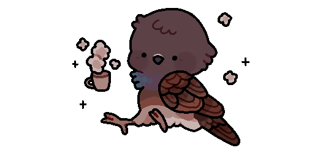
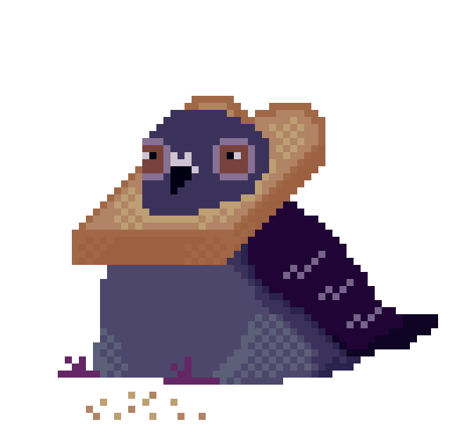
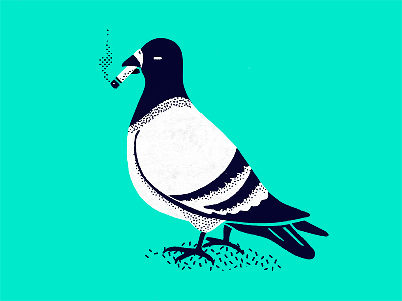
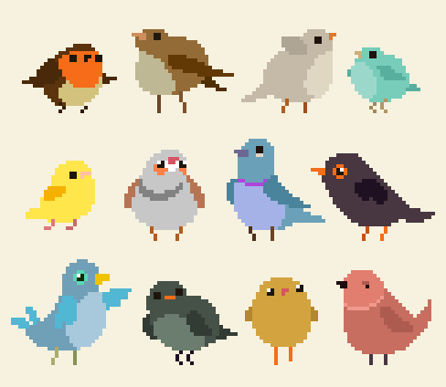

  
   

## Helloooo, you are reading the profile of Ammar Albreiki, aka Pejon 🐦
*⚡ I got the name "Pejon" cause I do pigeon noises on discord, with some creativity with letters*

and I am a game developer student at 42 Abu Dhabi (intra-login: Amalbrei), hoping to provide memorable experiences right unto your computers, I enjoy platformers, hero shooters, turn based and rougelites, feel free to find me on steam and discord below for a chat/game.

  

🔭 I’m currently a *mastery student at 42 Abu Dhabi*  
🌱 I’m currently learning *Unreal Engine*, *Unity* , *Blender*  
💼 I'm currently working at Khosouf Studio, Yas Creative Hub
#### 📫 My Social Medias:  

  &nbsp;   &nbsp;   &nbsp;   &nbsp;  &nbsp; <a href="mailto:pejonmail@gmail.com">   

#### 👨🏻‍💻 Languages and Tools  
<code></code>
<code></code>
<code></code>
<code></code>
<code></code>
<code></code>
<code></code>
<code></code>
<code></code>  

<h2 style="color: #44AEFB">📈 Statistics</h2>
 

## 🎮 Games Made  

### GameJams and Programs:  
- [A Gear in Whimsy](https://github.com/APejon/A-Gear-in-Whimsy)
- [Rahala](https://github.com/Unhinged-Game-Studio/Rahala/tree/main)
- [A Matter Of Size](https://github.com/Unhinged-Game-Studio/Matter-Of-Size)
### Job (at Khosouf Studio):
- GlitchCore (WIP)
### Personal:
- SlimedCore (WIP)

## 🐤 My PejonFam  

Please visit the github of my colleagues as well, wouldn't have made it here without them:  

  +
  +
  +
  
  

<!--
**APejon/APejon** is a ✨ _special_ ✨ repository because its `README.md` (this file) appears on your GitHub profile.

Here are some ideas to get you started:

- 🔭 I’m currently working on ...
- 🌱 I’m currently learning ...
- 👯 I’m looking to collaborate on ...
- 🤔 I’m looking for help with ...
- 💬 Ask me about ...
- 📫 How to reach me: ...
- 😄 Pronouns: ...
- ⚡ Fun fact: ...
-->
