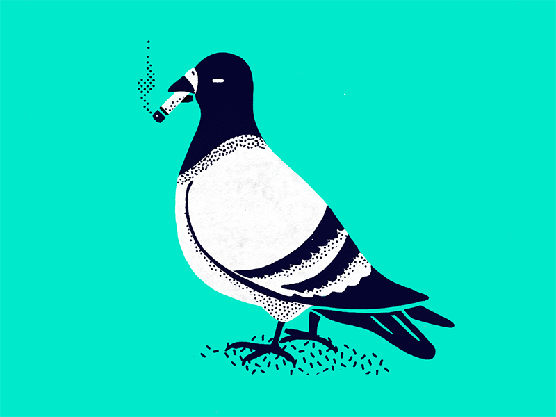

  
   

## Helloooo, you are reading the profile of Ammar Albreiki, aka Pejon 🐦
*⚡ Fun fact: I got the name "Pejon" cause I do pigeon noises on discord, with some creativity with letters*

and I am a game developer studying programming at 42 Abu Dhabi (intra-login: Amalbrei), hoping to provide memorable experiences right unto your computers, I enjoy platformers, hero shooters and rougelikes, feel free to find me on steam and discord below for a chat/game.

  

🔭 I’m currently working on ...  
🌱 I’m currently learning ...  
📫 My Social Medias:
<!--
**APejon/APejon** is a ✨ _special_ ✨ repository because its `README.md` (this file) appears on your GitHub profile.

Here are some ideas to get you started:

- 🔭 I’m currently working on ...
- 🌱 I’m currently learning ...
- 👯 I’m looking to collaborate on ...
- 🤔 I’m looking for help with ...
- 💬 Ask me about ...
- 📫 How to reach me: ...
- 😄 Pronouns: ...
- ⚡ Fun fact: ...
-->
